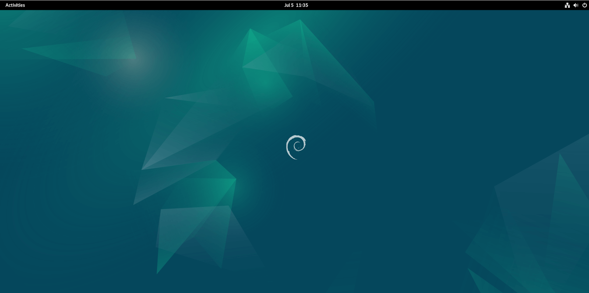

# debian 11 vs debian 12 🛰️

    Nama		: Moch. Irham Kafi Billah
    NRP		    : 3122600009
    Kelas		: 2 D4 Teknik Informatika
    Mata Kuliah	: Administrasi Jaringan
    Dosen Pengampu	: Dr. Ferry Astika Saputra ST, M.Sc

#

    

Perbedaan antara Debian 11 (bullseye) dan Debian 12 (bookworm). Debian 12 mencakup lompatan ke kernel Linux versi 6.1, yang menghadirkan dukungan eksperimental untuk Rust di kernel, peningkatan dukungan ARM SoC, dukungan untuk Intel Meteor Lake, dan banyak lagi..Perbedaan yang terjadi antara versi Debian tersebut termasuk:

### 1. Kernel Linux baru

Debian 12 'Kutu Buku' hadir dengan kernel Linux 6.1, rilis LTS (Dukungan Jangka Panjang) saat ini. Kernel hadir dengan sejumlah fitur dan perbaikan baru yang bertujuan untuk meningkatkan keamanan dan kinerja sistem Linux.

Anda dapat memverifikasi kernel Linux seperti yang ditunjukkan.

    

Sorotan utama dari kernel Linux 6.1 meliputi:
<ul>
<li>Dukungan arus utama untuk RUST, bahasa pemrograman tujuan umum;</li>
<li>Peningkatan kinerja yang signifikan untuk sistem file BTRFS;</li>
<li>Peningkatan kinerja untuk sistem file EXT4;</li>
<li>Dukungan struktur data Maple Tree;</li>
<li>Kontrol keamanan baru yang memfasilitasi pembuatan namespace pengguna;</li>
<li>Dukungan untuk CPU dan GPU generasi berikutnya. Hal ini mencakup peningkatan dukungan untuk chip AMD Ryzen dan Intel 'Meteor Lake';</li>
<li>Berbagai peningkatan untuk Intel Arc Graphics DG2/Alchemist;</li>
<li>Segudang dukungan perangkat keras, antara lain dukungan untuk perangkat game seperti pengontrol game Xbox, dukungan suara di Apple Silico, dan dukungan audio di Mediatek MT8186.</li>
</ul>

### 2. Perangkat Lunak Tidak Bebas dalam penginstal file ISO utama

Salah satu perubahan penting dari Debian 12 adalah dimasukkannya paket tidak bebas dalam image DVD ISO.

Sejak awal, Debian selalu mengemas paket gratis dan tidak gratis dalam file ISO terpisah. Oleh karena itu, jika Anda memerlukan, misalnya, driver grafis non-gratis atau firmware untuk perangkat keras unik, Anda perlu mengunduh file ISO terpisah.

Dengan Debian 12, file DVD ISO sekarang berisi paket perangkat lunak gratis dan tidak bebas. Ke depannya, pengguna hanya perlu mengunduh satu file ISO yang berisi semuanya. Hal ini memudahkan pemasangan perangkat lunak berpemilik tanpa perlu repot mengunduh banyak file ISO

### 3. Arsip paket baru untuk firmware tidak bebas

Sebelumnya, rilis Debian menyediakan tiga arsip paket: main, contrib, dan non-free.

Debian 12 memperkenalkan arsip paket tambahan untuk firmware tidak bebas yang menyediakan semua komponen firmware tidak bebas untuk perangkat keras Anda. Ini menciptakan perbedaan antara firmware tidak bebas dan paket perangkat lunak tidak bebas lainnya. Akibatnya, sebagian besar paket firmware tidak bebas kini telah dipindahkan dari paket tidak bebas ke firmware tidak bebas.

### 4. Server audio Pipewire secara default untuk GNOME

Berita luar biasa bagi para penggemar Pipewire ! Debian 12 menyediakan Pipewire out-of-the-box sebagai server audio default. Pipewire bertujuan untuk meningkatkan penanganan audio dan video di sistem Linux secara signifikan. Ini menggantikan PulseAudio, yang telah menjadi server audio default untuk sistem POSIX seperti Linux.

Untuk memverifikasi versi Pipewire yang diinstal, jalankan perintah:

    

### 5. Manajer paket APT 2.6

APT 2.6 adalah rilis terbaru APT di Debian 12. Penyertaannya memungkinkan penanganan firmware non-bebas yang lebih baik di Debian..

### 6. Tema dan wallpaper default baru

Seperti halnya rilis Linux baru lainnya, Debian 12 dikirimkan dengan tema wallpaper baru yang diberi nama 'Emerald.' Ini adalah wallpaper bergaya dengan rona hijau zamrud dan dirancang untuk menggambarkan keadaan batu permata yang mentah dan alami - dipahat dan dipoles dengan elegan

    

### 7. Lingkungan desktop baru

Debian 12 mendukung tumpukan lingkungan desktop yang hadir dalam versi baru. Mereka termasuk XFCE 4.18, KDE Plasma 5.27, LXQt 1.20, Cinnamon 5.6, MATE 1.26, dan LXDE 11. Satu-satunya pengecualian untuk ini adalah lingkungan desktop GNOME. Alih-alih GNOME 44 - versi terbaru - Anda mendapatkan GNOME 43 karena GNOME 44 terlambat dirilis untuk disertakan.

### 8. Rangkaian dan paket perangkat lunak baru

Lebih dari 67% paket perangkat lunak Debian 11 'Bullseye' telah diperbarui ke versi baru. Di antara paket perangkat lunak terbaru yang dibundel dalam Debian 12 meliputi:

### 9. Dukungan arsitektur tambahan

Perlu disebutkan bahwa Debian 12 menyediakan dukungan perangkat keras untuk arsitektur berikut:

<ul>
<li>PC 64-bit (amd64) dan PC 32-bit (i386)</li>
<li>LENGAN 64-bit (lengan64)</li>
<li>ARMv7 (EABI hard-float ABI, armhf)</li>
<li>IBM Sistem z (s390x)</li>
<li>MIPS little-endian (mipsel)</li>
<li>PowerPC little-endian 64-bit (ppc64el)</li>
<li>MIPS little-endian 64-bit (mipsel)</li>
</ul>

### 10. Perbaikan dan perubahan lainnya

Peningkatan penting lainnya yang disertakan dengan Debian 12 adalah sebagai berikut:

<ul>
<li>Dukungan baca/tulis untuk Sistem File Apple;</li>
<li>Deteksi Windows 11 dalam pengaturan dual-boot;</li>
<li>Dukungan Boot Aman di ARM64;</li>
<li>Deteksi perangkat multipath yang lebih mudah;</li>
<li>Penghentian dukungan DMRAID eksperimental.</li>
</ul>
