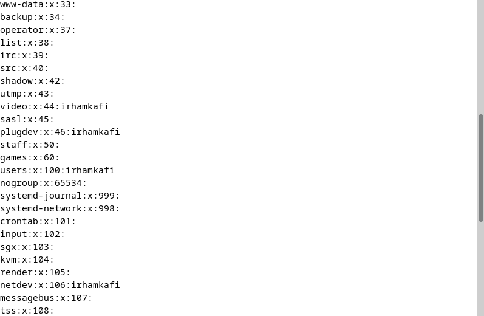

# cmd /etc/group 🛰️

    Nama		: Moch. Irham Kafi Billah
    NRP		    : 3122600009
    Kelas		: 2 D4 Teknik Informatika
    Mata Kuliah	: Administrasi Jaringan
    Dosen Pengampu	: Dr. Ferry Astika Saputra ST, M.Sc

#

    
    
    

Berkas /etc/group adalah salah satu berkas konfigurasi utama di sistem Linux, termasuk distribusi Debian. Ini digunakan untuk menyimpan informasi tentang grup-grup pengguna pada sistem. Setiap baris dalam berkas ini mewakili satu grup, dan setiap baris terdiri dari empat kolom terpisah oleh titik dua (:). 

### 1. penjelasan /etc/group tiap kolom

    

Berikut adalah penjelasan singkat tentang setiap kolom:
<ol>
  <li>Nama Grup: Kolom pertama berisi nama grup itu sendiri.</li>
  <li>Kata Sandi: Kolom kedua berisi kata sandi (biasanya dienkripsi) untuk grup tersebut. Namun, dalam banyak distribusi Linux modern, kolom ini biasanya diisi dengan tanda 'x' dan informasi kata sandi disimpan dalam berkas '/etc/gshadow' yang hanya dapat diakses oleh pengguna dengan hak istimewa tertentu.</li>
  <li>ID Grup (GID): Kolom ketiga berisi ID grup (GID), yaitu nomor identifikasi unik untuk grup tersebut. Setiap grup harus memiliki GID yang unik</li>
  <li>Anggota Grup: Kolom keempat berisi daftar pengguna yang menjadi anggota grup tersebut, dipisahkan oleh koma. Jika grup memiliki banyak anggota, mereka terdaftar di sini.</li>
</ol>

### 2. mengedit /etc/group

    

command yang bisa digunakan adalah nano atau vi untuk mengedit etc/group