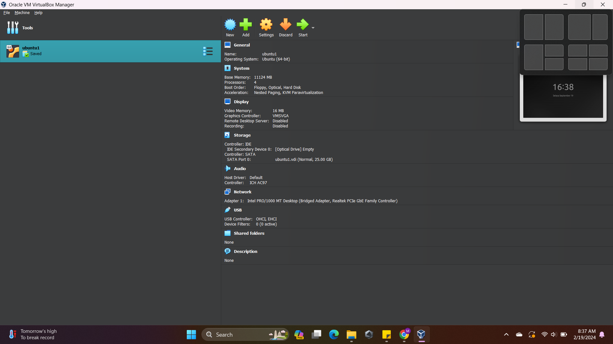
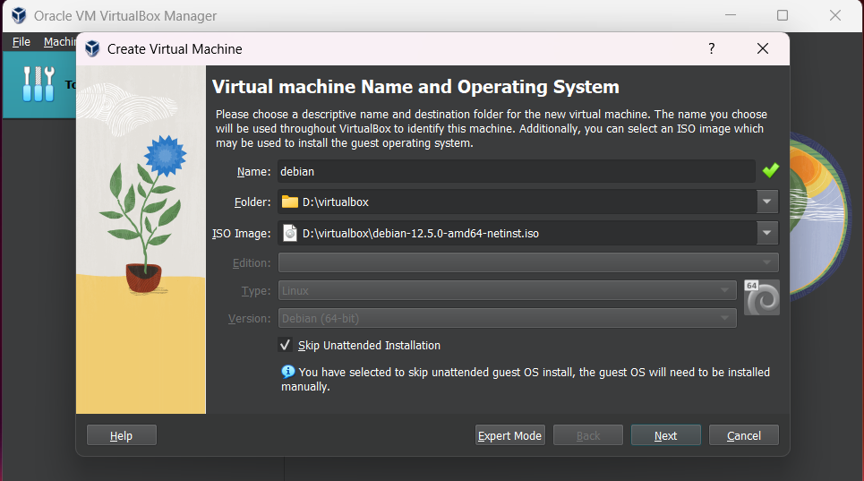
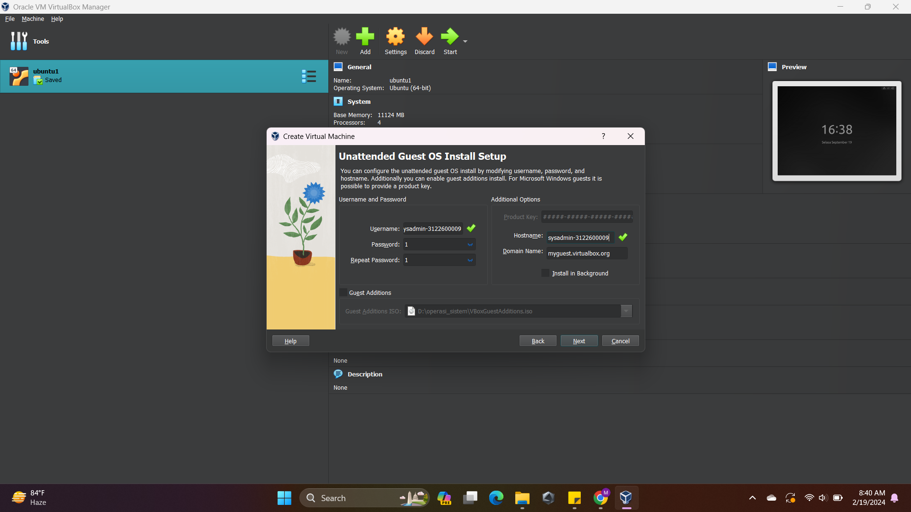
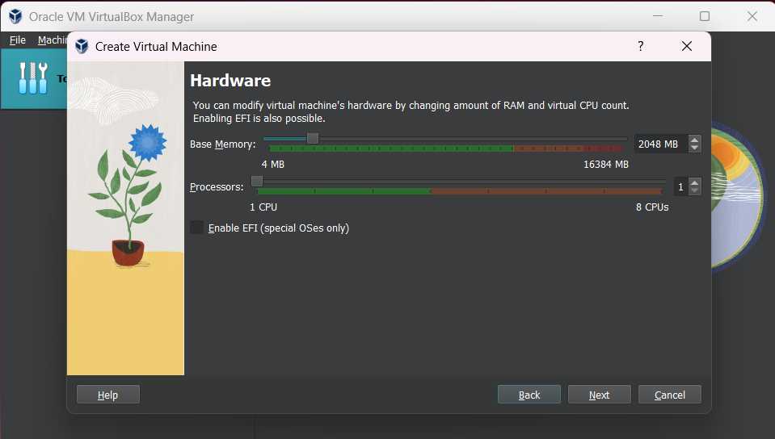
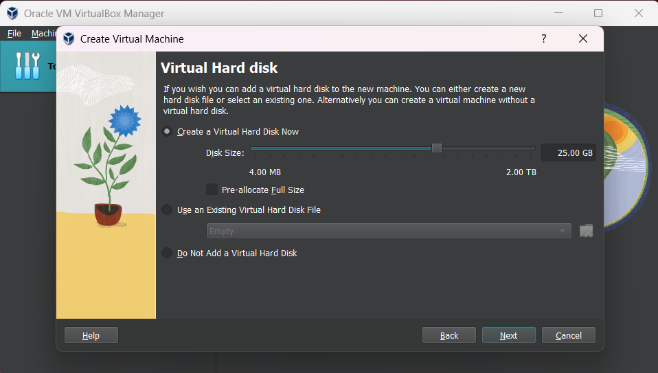
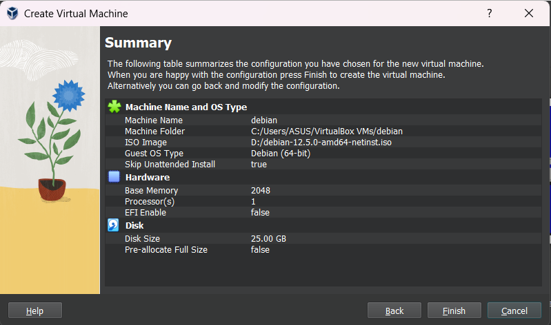

# instalasi debian 🛰️

    Nama		: Moch. Irham Kafi Billah
    NRP		    : 3122600009
    Kelas		: 2 D4 Teknik Informatika
    Mata Kuliah	: Administrasi Jaringan
    Dosen Pengampu	: Dr. Ferry Astika Saputra ST, M.Sc

#

    

Unduh VirtualBox: Pertama, Anda perlu mengunduh dan menginstal VirtualBox dari situs resminya (https://www.virtualbox.org/). Pastikan Anda memilih versi yang sesuai dengan sistem operasi Anda.

Unduh ISO Debian: Kunjungi situs web resmi Debian di https://www.debian.org/ dan unduh file ISO untuk distribusi Debian yang ingin Anda gunakan. Pilih versi yang sesuai dengan kebutuhan Anda, seperti Debian Stable atau Debian Testing.

### 1. Buat Mesin Virtual:

Buka VirtualBox setelah selesai mengunduh dan menginstalnya. Klik tombol "New" untuk membuat mesin virtual baru. Berikan nama untuk mesin virtual Anda dan pilih tipe dan versi sistem operasi yang akan diinstal (Linux, Debian)

    

### 2. Perangkat Lunak Tidak Bebas dalam penginstal file ISO utama

    

isi nama dengan debian, isi iso dengan iso yang sudah didownload.
jangan lupa mencentang kotak dibawah unutk menginstall secara manual 

    

ubah nama host dengan nama yang diinginkan.dan bisa mengisi password terserah anda

    

sesuaikan base memory dan processors sesuai yang anda inginkan disini saya memilih 2048 mb dan 1 processors

    

sesuaikan virttual hard disk anda. disini saya memakai 25gb

    

jika telah selesai tekan finish

### 3. install debian

    

